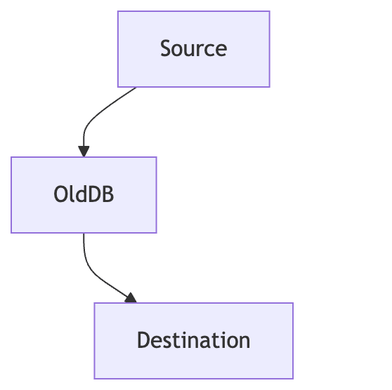
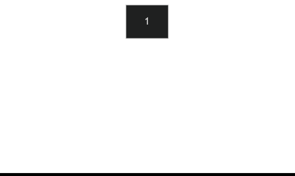

# Mermaid-gif-maker

[A small webpage](https://yairm210.github.io/Mermaid-gif-maker/) for making GIFs of mermaid graphs

Made with:
- [monaco-editor](https://github.com/microsoft/monaco-editor) and [monaco-mermaid](https://github.com/Yash-Singh1/monaco-mermaid) for the text editor
- [Mermaid](https://github.com/mermaid-js/mermaid) for graph rendering
- [html2canvas](https://github.com/niklasvh/html2canvas) and [gif.js](https://github.com/jnordberg/gif.js) for creating the GIF
- [simple.css](https://github.com/kevquirk/simple.css) for the styling

Uses a simple templating style to generate several similar frames from the same base text

- Tempates start with `{[` and end with `]}`, to not conflict with Mermaid constructs.
- Each part consists of the frame number, from which point on this applies
- So for example, `{[0 ~~~ |2 -.-> |3 --> ]}` means "from frame 0, be ` ~~~ `; from frame 2, be ` -.-> `; from frame 3, be ` --> `"

### Examples

Database migration

```
graph TD
Source {[0 --> |4 ~~~ ]} OldDB
Source {[0 ~~~ |1 --> ]} NewDB{[0 :::invisible |1 ]}
OldDB{[0 |4 :::invisible ]} {[0 --> |3 -.-> |4 ~~~ ]} Destination
NewDB {[0 ~~~ |2 -.-> |3 --> ]} Destination

classDef invisible fill-opacity:0, stroke-opacity:0, color:#0000;
```



Binary tree rotation



